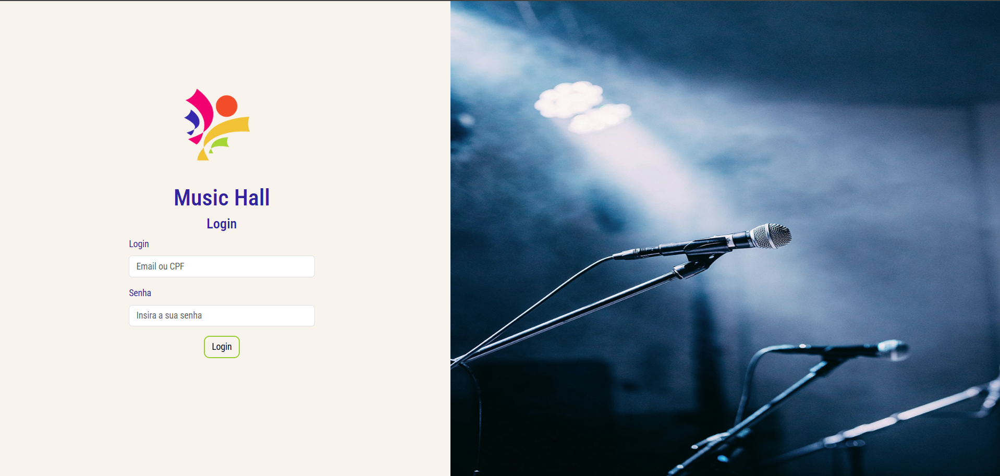

# Senac music hall

O Senac music hall é um sistema voltado ao gerenciamento da casa de show de mesmo nome que fica na cidade de Brasilia - DF. O sistema tem a função de cadastrar, listar, atualizar e deletar: Eventos, setores de cada evento, usuários e também somente cadastrar clientes. Além de também fazer a função de venda e emissão de ingressos para os eventos.

## Funcionalidades
- Cadastro de funcionários (Usuários)
- Separação de funcionários por perfil de acesso
- Cadastro de eventos
- Cadastro de setores por evento
- Exibição de eventos que vão acontecer
- Venda e emissão de ingressos por evento
- Validação e cancelamento de ingressos emitidos
- Dashboard administrativo com gráfico mostrando a venda de cada evento

## Função de cada perfil
- Administrador

O administrador é o perfil responsável por gerir as atividades do sistema, ele tem acesso total a todas as funcionalidades e gerencia os outros perfis também

- Vendedor

O vendedor tem a função somente de vender os ingressos dos eventos cadastrados no sistema ao cliente final

- Validador

O validador é o funcionário responsável por somente validar o código de acesso do ingresso do cliente e se estiver válido o ingresso, o cliente pode assistir ou participar do evento

## Screenshot



## Pré-requisitos
Para rodar o projeto em seu ambiente local é necessário a instalação do [Python](https://www.python.org/downloads/) e após a instalação seguir o passo a passo abaixo.
### Instalação do projeto

Criação do ambiente virtual
```bash
    virtualenv venv
```

Instalação dos pacotes necessários para rodar em arquivo requirements.txt
```bash
    pip install -r requirements.txt
```

Rodar o projeto em máquina local
```bash
    py manage.py runserver
```

## Variáveis de ambiente
Variáveis de ambiente necessárias para o projeto rodar em sua máquina, (arquivo `.env`).

`SECRET_KEY`

`DATABASE_NAME`

`DATABASE_PASSWORD`

`DATABASE_HOST`

`DATABASE_PORT`

## Protótipo figma

[Telas em protótipo](https://www.figma.com/proto/z4BZ5q7jon5Jx7oXNqXEig/music-hall?node-id=1-114&p=f&t=uBjBo0gEfX2EkLAu-1&scaling=scale-down&content-scaling=fixed&page-id=0%3A1&starting-point-node-id=1%3A114&show-proto-sidebar=1)